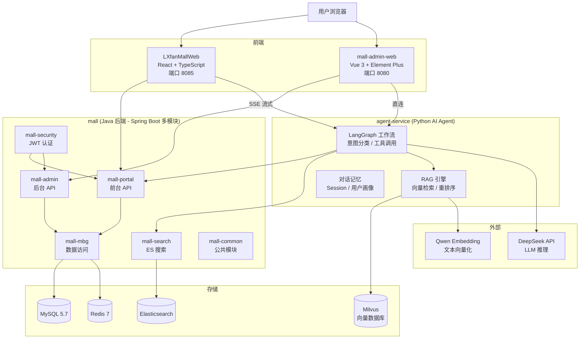
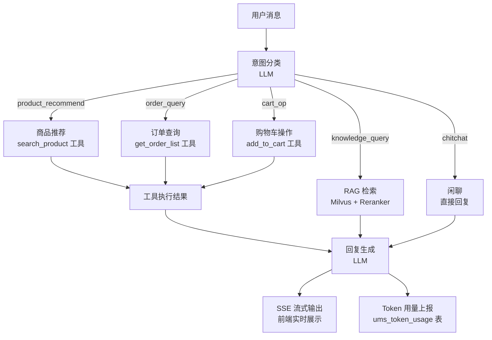
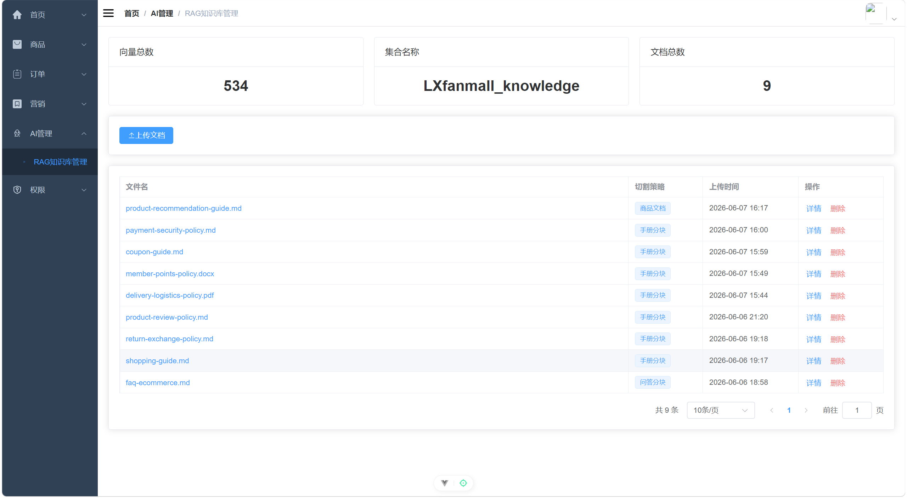
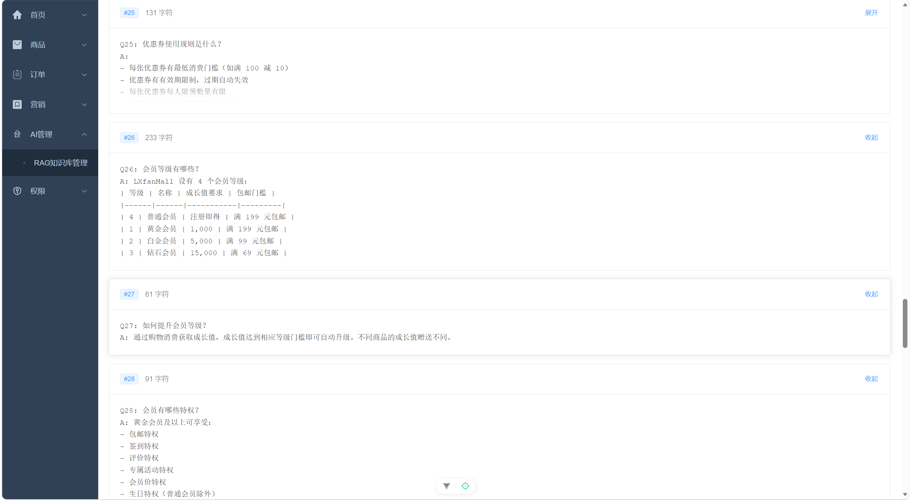
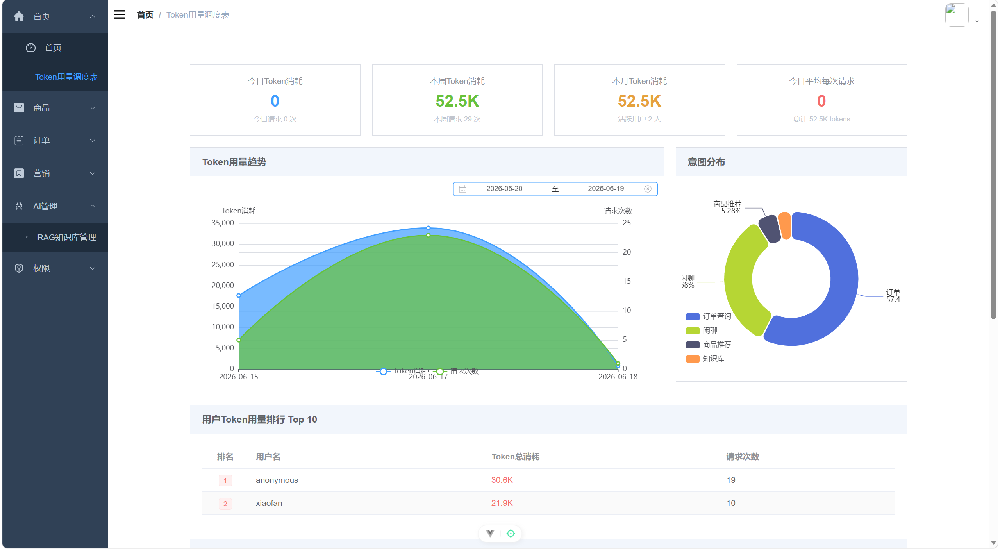
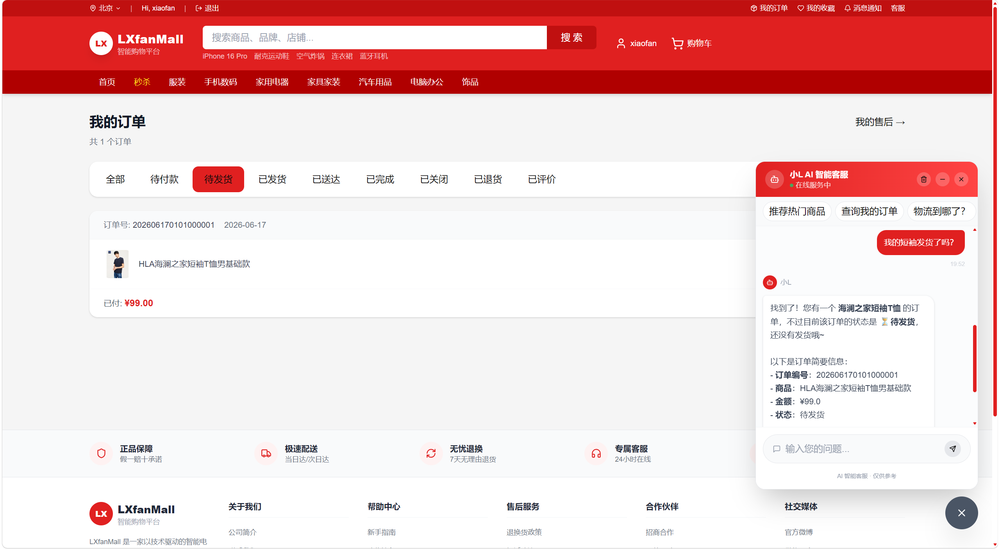

# LXfanMall — 电商 AI Agent 全栈应用

基于 [macrozheng/mall](https://github.com/macrozheng/mall) 二次开发的全栈电商平台，核心亮点是集成了 **AI Agent 智能助手**，支持 RAG 知识库检索、工具调用、多轮对话等能力。

> 本项目为个人学习与求职作品，重点展示 **AI 应用开发** 与 **全栈工程整合** 能力。

C端（用户商城）：在线演示[点击访问](http://122.51.36.175)

B端（管理后台）：在线演示[点击访问](http://122.51.36.175:8080)
> 注意：为演示方便，b、c端登录账号固定，且仅支持读取操作，不支持写入操作。如需更多功能，欢迎自己克隆项目进行开发。

## 系统架构

### 整体架构



### AI Agent 工作流



## 核心功能

### AI Agent（独立开发）

- **LangGraph 有向图工作流**：意图分类 → 节点路由 → 工具调用 → 结果整合
- **工具调用**：商品搜索、订单查询、购物车操作、商品评价等电商工具

- **RAG 检索增强**：支持 PDF/Word/Excel/HTML/Markdown 多格式文档解析，Milvus 向量检索 + 重排序


- **多轮对话记忆**：基于 session 的会话历史管理
- **用户画像**：行为分析与个性化推荐
- **SSE 流式输出**：前端实时展示 AI 回复
- **Token 用量统计**：采集每次对话的 token 消耗，上报到后端看板

- **安全防护**：速率限制、破坏性操作确认、Milvus 注入防护、admin 权限校验

### 电商平台（基于 macrozheng/mall 二次开发）

- **商品管理**：品牌、分类、属性、SKU、搜索（ES）
- **购物车**：增删改查、优惠计算
- **订单系统**：下单、支付模拟、超时取消、物流模拟、自动签收
- **评价系统**：商品评价、星级评分
- **管理后台**：数据看板、商品/订单/营销管理
- **用户系统**：JWT 认证、阿里云号码认证、收货地址管理
- **智能客服系统**：基于 AI Agent 实现智能客服，处理用户咨询、订单查询等


## 技术栈

| 层级 | 技术 |
|------|------|
| **AI Agent** | Python 3.11、FastAPI、LangChain、LangGraph、DeepSeek API |
| **RAG** | Milvus、Qwen Embedding、Qwen Reranker、自研文档解析器 |
| **后端** | Java 8+、Spring Boot 2.7、MyBatis、Redis、Elasticsearch |
| **前端（用户端）** | React 18、TypeScript、Vite、react-router v7、Zustand、shadcn/ui、Tailwind CSS |
| **前端（管理端）** | Vue 3、TypeScript、Element Plus、ECharts、Pinia |
| **基础设施** | MySQL 5.7、Redis 7、RabbitMQ、MinIO、Nginx |
| **部署** | Docker Compose |

## 项目结构

```
LXfanMall/
├── agent-service/          # AI Agent 服务（Python）
│   ├── app/
│   │   ├── agent/          # LangGraph 工作流、工具、提示词
│   │   ├── api/            # FastAPI 接口（SSE 对话、RAG、用户）
│   │   ├── rag/            # RAG 引擎（分块、嵌入、检索、重排）
│   │   ├── deepdoc/        # 多格式文档解析器
│   │   ├── nlp/            # 分词、关键词提取、查询构建
│   │   ├── memory/         # 用户画像
│   │   ├── mcp/            # MCP 协议适配器
│   │   ├── core/           # 限流、异常、日志
│   │   └── config/         # 配置管理
│   ├── data/rag-data/      # RAG 知识库文档
│   ├── tests/              # 单元测试
│   ├── Dockerfile
│   └── pyproject.toml
│
├── mall/                   # 电商后端（Java，基于 macrozheng/mall）
│   ├── mall-common/        # 公共工具类
│   ├── mall-security/      # JWT 认证
│   ├── mall-mbg/           # MyBatis 代码生成
│   ├── mall-portal/        # 前台 API
│   ├── mall-admin/         # 后台管理 API
│   ├── mall-search/        # ES 搜索服务
│   └── document/           # SQL 脚本、Docker 配置、Postman
│
├── LXfanMallWeb/           # 用户端前端（React）
│   └── src/
│       ├── app/pages/      # 页面（首页、商品、购物车、订单、AI 对话）
│       ├── app/components/ # 组件（TopBar、AI 浮球、物流弹窗等）
│       ├── store/          # Zustand 状态管理
│       └── utils/          # API 封装、工具函数
│
├── mall-admin-web/         # 管理后台前端（Vue）
│   └── src/
│       ├── views/          # 页面（数据看板、商品管理、Token 统计）
│       ├── apis/           # API 封装
│       └── stores/         # Pinia 状态管理
│
└── start-web.bat           # 快速启动脚本
```

## 快速启动

### 环境要求

| 依赖 | 版本 |
|------|------|
| JDK | 8+ |
| Maven | 3.6+ |
| Node.js | 18+ |
| Python | 3.11+ |
| Docker & Docker Compose | 最新版 |

### 1. 启动基础设施（MySQL、Redis、Milvus 等）

```bash
cd mall/document/docker
docker compose -f docker-compose-env.yml up -d
```

这会启动：MySQL (3307)、Redis (6379)、RabbitMQ (5672)、Elasticsearch (9200)、MinIO (9090)、Milvus (19530)

### 2. 初始化数据库

```bash
# 连接 MySQL (端口 3307，用户名 root，密码 root)
# 执行 mall/document/sql/mall.sql
mysql -h localhost -P 3307 -u root -proot mall < mall/document/sql/mall.sql
```

### 3. 启动后端服务

```bash
cd mall

# 启动 mall-portal（前台 API，端口 8085）
mvn spring-boot:run -pl mall-portal -Dspring-boot.run.profiles=dev

# 启动 mall-admin（后台 API，端口 8080）
mvn spring-boot:run -pl mall-admin -Dspring-boot.run.profiles=dev

# 启动 mall-search（搜索服务，端口 8081）
mvn spring-boot:run -pl mall-search -Dspring-boot.run.profiles=dev
```

### 4. 启动 AI Agent 服务

```bash
cd agent-service

# 创建虚拟环境
python -m venv .venv
source .venv/bin/activate  # Windows: .venv\Scripts\activate

# 安装依赖
pip install -e .

# 配置环境变量（复制模板后填入你的 API Key）
cp .env.example .env
# 编辑 .env，填入 LLM_API_KEY、EMBEDDING_API_KEY 等

# 启动服务（端口 8000）
uvicorn app.main:app --host 0.0.0.0 --port 8000
```

### 5. 启动前端

```bash
# 用户端前端（端口 8085）
cd LXfanMallWeb
npm install
npm run dev

# 管理后台前端（端口 8090）
cd mall-admin-web
npm install
npm run dev
```

或者直接运行根目录的启动脚本：

```bash
start-web.bat      # 启动用户端前端
start-admin.bat    # 启动管理后台前端
```

### 6. 访问

| 服务 | 地址 |
|------|------|
| 用户端前端 | http://localhost:8085 |
| 管理后台 | http://localhost:8090 |
| 前台 API | http://localhost:8085/api |
| 后台 API | http://localhost:8080/api |
| AI Agent | http://localhost:8000 |
| RabbitMQ 管理 | http://localhost:15672 |
| MinIO 控制台 | http://localhost:9001 |
| Kibana | http://localhost:5601 |

## 环境变量

### agent-service

在 `agent-service/.env` 中配置（参考 `.env.example`）：

```env
# LLM
LLM_API_KEY=your-deepseek-api-key
LLM_BASE_URL=https://api.deepseek.com/v1

# Embedding & Reranker
EMBEDDING_API_KEY=your-dashscope-api-key
RERANKER_API_KEY=your-dashscope-api-key

# 后端地址
MALL_PORTAL_URL=http://localhost:8085
MALL_SEARCH_URL=http://localhost:8081
```

## 致谢

- 电商后端基于 [macrozheng/mall](https://github.com/macrozheng/mall) 二次开发
- 管理后台前端基于 [macrozheng/mall-admin-web](https://github.com/macrozheng/mall-admin-web) 改造

在此基础上，本人独立完成了 AI Agent 服务、RAG 检索引擎、用户端前端的全部开发工作。
