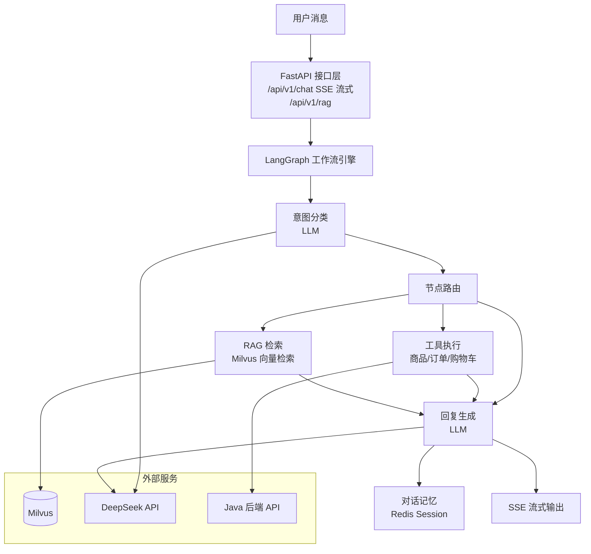

# agent-service — AI Agent 智能助手服务

基于 FastAPI + LangChain + LangGraph 构建的电商 AI Agent 服务，为 LXfanMall 提供智能对话、RAG 知识库检索、工具调用等能力。

## 架构概览



## 目录结构

```
agent-service/
├── app/
│   ├── agent/              # LangGraph 工作流核心
│   │   ├── graph.py        # 有向图定义与编排
│   │   ├── nodes.py        # 图节点（分类、工具、回复）
│   │   ├── router.py       # 意图路由与分类器
│   │   ├── tools.py        # 电商工具集（商品/订单/购物车/评价）
│   │   ├── prompts.py      # 提示词模板
│   │   ├── llm.py          # LLM 客户端封装
│   │   ├── session.py      # 会话管理
│   │   ├── token_callback.py   # Token 用量采集
│   │   └── token_reporter.py   # Token 上报到 Java 后端
│   │
│   ├── api/                # FastAPI 接口
│   │   └── v1/
│   │       ├── chat.py     # SSE 流式对话接口
│   │       ├── rag.py      # RAG 知识库管理接口
│   │       ├── user.py     # 用户认证接口
│   │       └── deps.py     # 依赖注入
│   │
│   ├── rag/                # RAG 检索引擎
│   │   ├── engine.py       # RAG 编排引擎
│   │   ├── chunker.py      # 文档分块（语义切分）
│   │   ├── embedder.py     # 向量嵌入（Qwen text-embedding-v4）
│   │   ├── retrieval.py    # Milvus 向量检索
│   │   ├── reranker.py     # 重排序（Qwen gte-rerank-v2）
│   │   ├── vector_store.py # Milvus 连接管理
│   │   ├── query_cache.py  # 查询缓存（Redis）
│   │   └── document_service.py  # 文档上传与管理
│   │
│   ├── deepdoc/            # 多格式文档解析器
│   │   ├── pdf_parser.py   # PDF 解析
│   │   ├── docx_parser.py  # Word 解析
│   │   ├── excel_parser.py # Excel 解析
│   │   ├── html_parser.py  # HTML 解析
│   │   ├── md_parser.py    # Markdown 解析
│   │   └── txt_parser.py   # 纯文本解析
│   │
│   ├── nlp/                # NLP 处理
│   │   ├── keyword_extractor.py  # 关键词提取
│   │   ├── query_builder.py      # 查询意图分析与构建
│   │   ├── text_processor.py     # 文本清洗
│   │   └── tokenizer.py          # 中文分词
│   │
│   ├── memory/             # 用户画像
│   │   └── user_profile.py # 行为分析与个性化
│   │
│   ├── mcp/                # MCP 协议适配
│   │   └── mall_adapter.py # 与 Java 后端通信
│   │
│   ├── core/               # 基础设施
│   │   ├── limiter.py      # 速率限制
│   │   ├── exceptions.py   # 异常处理
│   │   └── logging.py      # 结构化日志
│   │
│   ├── config/             # 配置
│   │   ├── settings.py     # Pydantic Settings
│   │   └── constants.py    # 常量定义
│   │
│   ├── models/             # 数据模型
│   │   └── schemas.py      # Pydantic Schema
│   │
│   └── main.py             # 应用入口
│
├── data/
│   └── rag-data/           # RAG 知识库文档
│
├── tests/                  # 单元测试
│   ├── unit/
│   │   ├── test_router.py
│   │   ├── test_deps.py
│   │   └── test_tool_result.py
│   └── test_phase3_smoke.py
│
├── .env.example            # 环境变量模板
├── Dockerfile
├── pyproject.toml
└── requirements.txt
```

## 核心模块详解

### 1. LangGraph 工作流 (`agent/`)

采用 LangGraph 有向图实现 Agent 决策流程：

- **意图分类**：LLM 分析用户消息，判断意图（商品推荐、订单查询、闲聊等）
- **节点路由**：根据意图选择执行路径（工具调用 / RAG 检索 / 直接回复）
- **工具执行**：调用电商 API 完成具体操作
- **结果整合**：将工具返回结果交给 LLM 生成自然语言回复

支持的工具：
| 工具 | 功能 |
|------|------|
| `search_product` | 商品搜索（支持关键词、分类、价格区间） |
| `get_product_detail` | 获取商品详情 |
| `get_order_list` | 查询订单列表 |
| `get_cart` | 查看购物车 |
| `add_to_cart` | 添加商品到购物车 |
| `submit_review` | 提交商品评价 |

### 2. RAG 检索引擎 (`rag/`)

全链路 RAG 实现：

1. **文档解析** (`deepdoc/`)：支持 PDF、Word、Excel、HTML、Markdown、TXT
2. **文档分块** (`chunker/`)：语义感知的智能切分
3. **向量嵌入** (`embedder/`)：调用 Qwen text-embedding-v4 生成向量
4. **向量存储** (`vector_store/`)：Milvus 集合管理
5. **检索** (`retrieval/`)：基于向量相似度的 Top-K 检索
6. **重排序** (`reranker/`)：Qwen gte-rerank-v2 精排
7. **缓存** (`query_cache/`)：Redis 缓存高频查询结果

### 3. 安全防护 (`core/`)

- **速率限制**：基于 IP 的请求频率控制
- **破坏性操作确认**：删除购物车、取消订单等操作需要二次确认
- **注入防护**：Milvus 查询参数化，防止向量注入攻击
- **权限校验**：admin 接口的 JWT 权限验证

### 4. 可观测性

- **Token 用量采集**：通过 LangChain Callback 记录每次对话的 token 消耗
- **Token 上报**：定期批量上报到 Java 后端的 `ums_token_usage` 表
- **结构化日志**：请求 ID 追踪、意图分类日志、工具调用日志

## API 接口

### SSE 流式对话

```
POST /api/v1/chat/stream
Authorization: Bearer <jwt_token>

{
  "message": "帮我推荐一款项链",
  "session_id": "optional-session-id"
}

Response: text/event-stream
data: {"type": "token", "content": "好的"}
data: {"type": "token", "content": "，为您推荐"}
data: {"type": "tool_call", "tool": "search_product", "args": {...}}
data: {"type": "tool_result", "result": [...]}
data: {"type": "token", "content": "以下几款项链..."}
data: {"type": "done", "session_id": "xxx"}
```

### RAG 知识库管理

```
POST /api/v1/rag/upload      # 上传文档到知识库
GET  /api/v1/rag/documents   # 获取文档列表
DELETE /api/v1/rag/documents/{id}  # 删除文档
POST /api/v1/rag/query       # 手动查询知识库
```

## 环境变量

参考 `.env.example`，关键配置：

```env
# LLM（必需）
LLM_API_KEY=sk-xxx
LLM_BASE_URL=https://api.deepseek.com/v1
LLM_MODEL_NAME=deepseek-chat

# Embedding（RAG 必需）
EMBEDDING_API_KEY=sk-xxx
EMBEDDING_MODEL=text-embedding-v4

# Reranker（RAG 必需）
RERANKER_API_KEY=sk-xxx
RERANKER_MODEL=gte-rerank-v2

# 后端地址
MALL_PORTAL_URL=http://localhost:8085
MALL_SEARCH_URL=http://localhost:8081

# Milvus
MILVUS_HOST=localhost
MILVUS_PORT=19530
```

## 启动

```bash
# 安装依赖
python -m venv .venv
source .venv/bin/activate
pip install -e .

# 配置环境变量
cp .env.example .env
# 编辑 .env 填入 API Key

# 启动
uvicorn app.main:app --host 0.0.0.0 --port 8000

# 运行测试
pytest
```

## 技术栈

| 组件 | 技术 |
|------|------|
| Web 框架 | FastAPI + Uvicorn |
| Agent 框架 | LangChain + LangGraph |
| LLM | DeepSeek API |
| 向量数据库 | Milvus |
| Embedding | Qwen text-embedding-v4 |
| Reranker | Qwen gte-rerank-v2 |
| 缓存 | Redis |
| 数据校验 | Pydantic v2 |
| 认证 | python-jose (JWT) |
| 测试 | pytest + pytest-asyncio |
