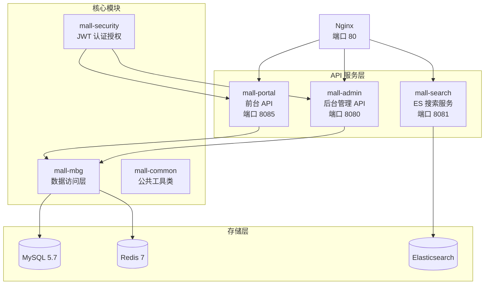

# mall — 电商后端服务

基于 [macrozheng/mall](https://github.com/macrozheng/mall) 二次开发的 Spring Boot 电商后端，为 LXfanMall 提供完整的电商业务 API。

## 架构



## 子模块说明

| 模块 | 端口 | 说明 |
|------|------|------|
| `mall-portal` | 8085 | 前台 API（商品浏览、购物车、订单、支付、评价） |
| `mall-admin` | 8080 | 后台管理 API（商品管理、订单管理、营销管理、数据看板） |
| `mall-search` | 8081 | Elasticsearch 商品搜索服务 |
| `mall-security` | — | JWT 认证授权、安全过滤器 |
| `mall-mbg` | — | MyBatis Generator 生成的数据访问层 |
| `mall-common` | — | 公共工具类、通用响应封装、枚举常量 |
| `mall-demo` | — | 示例代码（原项目自带，未修改） |

## 二次开发内容

以下功能为在原项目基础上新增或深度改造的部分：

### 评价系统

- 新增 `pms_comment` 表扩展字段（`member_id`、`order_id`、`order_item_id`）
- 评价提交接口（星级评分 + 文字 + 图片）
- 评价查询接口（按商品、按用户）

### 物流系统

- 模拟物流信息生成（发货 → 运输中 → 派送 → 签收）
- 定时任务自动更新物流状态
- 订单自动签收（物流完成后自动标记已送达）

### 首页数据看板

- 会员统计（今日注册、总数）
- 商品统计（上架数、总数）
- 订单统计（今日订单、本月订单、各状态数量）
- 金额统计（今日销售额、本月销售额）
- 带 Redis 缓存

### Token 用量统计

- 新增 `ums_token_usage` 表
- Agent 服务上报接口（批量写入）
- 统计查询接口（按用户、按意图、按时间、排名）
- 带 Redis 缓存

### 阿里云号码认证

- 短信验证码发送（阿里云 SMS）
- 号码认证服务集成

### 其他改进

- 枚举常量规范化（`OrderStatus`、`PayType`、`SourceType` 等）
- 下单/支付幂等校验
- 购物车结算 bug 修复
- 管理员登录异常处理优化

## 目录结构

```
mall/
├── mall-common/            # 公共模块
│   └── src/main/java/com/macro/mall/common/
│       ├── api/            # 通用响应（CommonResult, ResultCode）
│       ├── config/         # Redis 配置
│       ├── constant/       # 业务枚举常量
│       └── ...
│
├── mall-security/          # 安全模块
│   └── src/main/java/com/macro/mall/security/
│       ├── config/         # Spring Security 配置
│       ├── component/      # JWT 过滤器、动态权限
│       └── util/           # JWT 工具类
│
├── mall-mbg/               # 数据访问层
│   └── src/main/java/
│       ├── com/macro/mall/mapper/    # MyBatis Mapper
│       ├── com/macro/mall/model/     # 实体类
│       └── resources/generator/      # MBG 配置
│
├── mall-portal/            # 前台 API
│   └── src/main/java/com/macro/mall/portal/
│       ├── controller/     # 接口层
│       ├── service/        # 业务逻辑
│       ├── dao/            # 自定义 SQL
│       ├── domain/         # DTO
│       └── component/      # 定时任务等
│
├── mall-admin/             # 后台管理 API
│   └── src/main/java/com/macro/mall/
│       ├── controller/     # 接口层
│       ├── service/        # 业务逻辑
│       ├── dao/            # 自定义 SQL
│       └── dto/            # DTO
│
├── mall-search/            # 搜索服务
│   └── src/main/java/com/macro/mall/search/
│       ├── controller/     # 搜索接口
│       └── service/        # ES 操作
│
├── mall-demo/              # 示例代码
│
└── document/               # 项目文档
    ├── sql/mall.sql        # 数据库初始化脚本
    ├── docker/             # Docker Compose 配置
    ├── postman/            # Postman 接口集合
    └── sh/                 # 部署脚本
```

## 数据库

### 主要业务表

| 表前缀 | 说明 | 代表表 |
|--------|------|--------|
| `pms_` | 商品系统 | product, brand, category, comment |
| `oms_` | 订单系统 | order, order_item, cart_item, logistics_trace |
| `ums_` | 用户系统 | member, admin, role, resource, token_usage |
| `sms_` | 营销系统 | coupon, flash_promotion, home_advertise |
| `cms_` | 内容系统 | subject, help, topic |

### 新增表（二次开发）

- `pms_comment` — 商品评价（扩展了 member_id, order_id, order_item_id）
- `ums_token_usage` — AI Token 用量记录

## API 概览

### mall-portal（前台）

| Controller | 路径前缀 | 功能 |
|-----------|---------|------|
| `OmsCartItemController` | `/cart` | 购物车增删改查 |
| `OmsPortalOrderController` | `/order` | 下单、支付、取消、确认收货 |
| `OmsPortalOrderReturnApplyController` | `/returnApply` | 退换货申请 |
| `PmsPortalProductController` | `/product` | 商品搜索、详情 |
| `PmsPortalBrandController` | `/brand` | 品牌详情、商品列表 |
| `PmsCommentController` | `/comment` | 评价提交、查询 |
| `UmsMemberController` | `/member` | 登录、注册、信息修改 |
| `UmsMemberReceiveAddressController` | `/member/address` | 收货地址管理 |
| `UmsMemberCouponController` | `/member/coupon` | 优惠券领取、使用 |
| `HomeController` | `/home` | 首页聚合数据 |
| `AlipayController` | `/alipay` | 支付宝支付（沙箱） |

### mall-admin（后台）

| Controller | 路径前缀 | 功能 |
|-----------|---------|------|
| `PmsProductController` | `/product` | 商品 CRUD |
| `OmsOrderController` | `/order` | 订单管理、发货 |
| `SmsCouponController` | `/coupon` | 优惠券管理 |
| `SmsFlashPromotionController` | `/flash` | 秒杀活动管理 |
| `UmsAdminController` | `/admin` | 管理员管理 |
| `UmsRoleController` | `/role` | 角色权限管理 |
| `HomeController` | `/home` | 首页数据看板 |
| `TokenUsageController` | `/tokenUsage` | Token 用量统计 |
| `RagProxyController` | `/rag` | RAG 代理转发 |

## 启动

### 环境要求

- JDK 8+
- Maven 3.6+
- MySQL 5.7
- Redis 7
- Elasticsearch 7.17（mall-search 需要）

### 步骤

```bash
# 1. 启动基础设施
cd document/docker
docker compose -f docker-compose-env.yml up -d

# 2. 初始化数据库
mysql -h localhost -P 3307 -u root -proot mall < document/sql/mall.sql

# 3. 编译项目
cd ..
mvn clean package -DskipTests

# 4. 启动服务
mvn spring-boot:run -pl mall-portal -Dspring-boot.run.profiles=dev
mvn spring-boot:run -pl mall-admin -Dspring-boot.run.profiles=dev
mvn spring-boot:run -pl mall-search -Dspring-boot.run.profiles=dev
```

## 技术栈

| 组件 | 技术 |
|------|------|
| 框架 | Spring Boot 2.7 |
| ORM | MyBatis + MyBatis Generator |
| 认证 | Spring Security + JWT |
| 缓存 | Redis + Spring Data Redis |
| 搜索 | Elasticsearch 7.x |
| 消息队列 | RabbitMQ |
| 对象存储 | MinIO |
| 支付 | 支付宝沙箱 |
| API 文档 | Swagger (mall-demo) |
| 定时任务 | Spring @Scheduled |

## 致谢

本模块基于 [macrozheng/mall](https://github.com/macrozheng/mall) 二次开发，感谢原作者的优秀项目。
